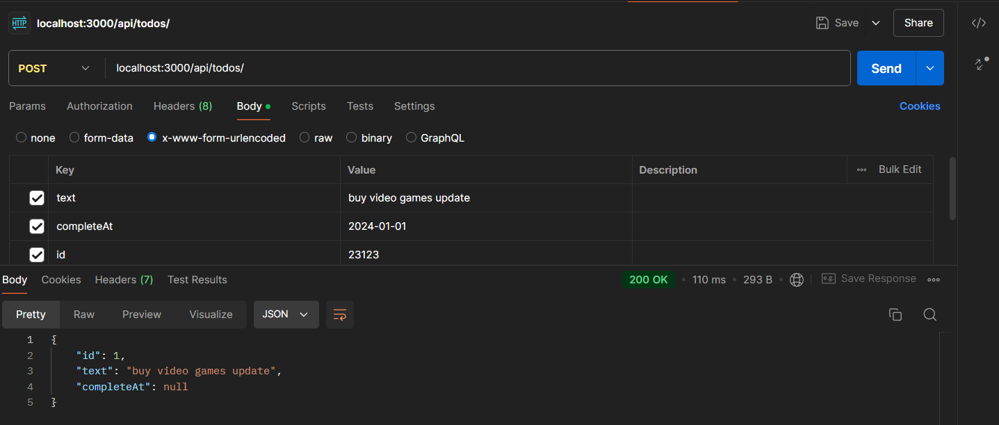

npm init -y

DOCU: https://gist.github.com/Klerith/3ba17e86dc4fabd8301a59699b9ffc0b

* Instalar TypeScript y demás dependencias
npm i -D typescript @types/node ts-node-dev rimraf

* Inicializar el archivo de configuración de TypeScript ( Se puede configurar al gusto)

npx tsc --init --outDir dist/ --rootDir src

* Crear scripts para dev, build y start

  "dev": "tsnd --respawn --clear src/app.ts",
  "build": "rimraf ./dist && tsc",
  "start": "npm run build && node dist/app.js"

######## EJECUTAR ########
npm run dev

abrir el servidor en 
http://localhost:8080/

## crear certificados openssl
//! recordar poner la consola en el directorio donde esta el proyecto ya que generara los archivos donde se encuentre alojado el actual CD

en powershel al tenes instalado git colocar "openssl"
si no aparece nada como si no estuviera activado buscar en inicio env
INICIO -> buscar 'env' -> variables de entorno
-> editar el que dice 'path'

buscar el archivo en donde esta instalado el openssl de git en mi caso:

C:\Program Files\Git\usr\bin\openssl.exe
y agregar en path el siguiente directorio
C:\Program Files\Git\usr\bin\

--> guardar cambios, cerrar el powershel y volverlo a abrir y ejecutar "openssl" para verificar que ya este funcionando

## ahora pegar el siguiente comando

openssl req -x509 -sha256 -nodes -days 365 -newkey rsa:2048 -keyout server.key -out server.crt

nos pregunta el pais: AR
cual es el estado: BUENOS AIRES
etc. etc.

ahora se puede ingresar al sitio por
https://localhost:8080/

############## INSTALAR EXPRESS ##############
https://expressjs.com/
npm install express

### instalar tipado de expres en ts ###
npm i --save-dev @types/express

el servidor correra sobre
http://localhost:3000/

######### opcional instalar htt-server GLOBAL #####
//! abrir la consola como admin
npm i -g http-server

ya que los .env no se guardan en el repo cambiar el 

.env.templete por el .env

######### INSTALAR dotenv ######### (interpretador de variables de entorno)
npm i dotenv env-var

## desplegar aplicaciones de node en https://railway.app

enlazar con cuenta de git, va a pedir validar seguridad desde el dispositivo movil
seleccionar el repo que creamos con el capitulo 7 

lego seleccionamos el repo y le damos en ejecutar
cuando finalice para crear un link hay que ir a settings 
public HTTP networking -> generate domain

en mi caso el link fue este:
https://node-webrest-server-production-44a5.up.railway.app/marvel

## ejemplos de status code para api
https://developer.mozilla.org/en-US/docs/Web/HTTP/Status

## ya actualizado el repo "node-webrest-server" 
podemos acceder a la api en el siguiente link
https://node-webrest-server-production-44a5.up.railway.app/api/todos/

## ejecutar contenedor con base de datos postgres
docker compose up -d

## instalar prisma para postgres en node

https://www.prisma.io/docs/getting-started/quickstart

npm install prisma --save-dev

npx prisma init --datasource-provider postgresql

## despues de este comando se puede visualizar la creación de la carpeta prisma en el directorio y ademas una nueva variable de entorno en el .env llamada DATABASE_URL, en mi caso yo ya la tenia creada en POSTGRES_URL entonces en prisma/schema.prisma cambiamos la variable de entorno que toma la dirreccion rapida de la BD

## este comando inferior no lo usaremos pero es el que trae el modelo directamente de la BD
<!-- npx prisma db pull -->
en nuestro caso crearemos los modelos en el 07-RESTWeb\prisma\schema.prisma manualmente

en nuestro caso el modelo es este

model todo {
  id Int @id @default(autoincrement())
  text String @db.VarChar
  completeAt DateTime? @db.Timestamp()
}

## y para migrar el modelo a la bd utilizar el siguiente comando
npx prisma migrate dev --name init

# llamada de la api con postgres para ingresar un registro

# EJEMPLOS DE USO API

//! IMPORTANTE el id no se envia por el urlencoded sino por los parametros de la link api/todos/{ID}

{get}localhost:3000/api/todos/ -- trae todo
{get}localhost:3000/api/todos/1 -- trae el de id 1
{post}localhost:3000/api/todos/ -- inserta x-www-form-urlencoded enviar la clave text: '{String}'
{put}localhost:3000/api/todos/1 -- inserta x-www-form-urlencoded enviar text: '{String}' || completeAt '{Date}' para cambiar los valores
{delete}localhost:3000/api/todos/1 -- inserta x-www-form-urlencoded enviar la clave id: '{Int}' para eliminar el row