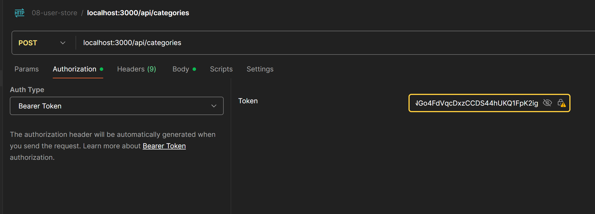

# Rest Project + TypeScript

Este proyecto previamente inicializado tiene todo lo necesario para trabajar con TypeScript, Express y Rest.

Cada paso de su configuración ya se ha realizado previamente en el curso, por lo que solo es necesario clonar el proyecto y comenzar a trabajar.

## Instalación

1. Clonar .env.template a .env y configurar las variables de entorno
2. Ejecutar `npm install` para instalar las dependencias
3. En caso de necesitar base de datos, configurar el docker-compose.yml y ejecutar `docker-compose up -d` para levantar los servicios deseados.
4. Ejecutar npm run seed para poblar de test la BD de mongo
5. Ejecutar `npm run dev` para levantar el proyecto en modo desarrollo

---------------
-- POSTMAN --
(POST) localhost:3000/api/auth/login    => 'loginUser'
(POST) localhost:3000/api/auth/register => 'registerUser'
(GET) localhost:3000/api/auth/validate-email/ABC => 'validateEmail'

-- 
npm install mongoose

-- app
https://www.mongodb.com/try/download/compass

DDD "domain" = reglas de negocio
DDD "dto" = data transfer object

# como enviar datos por POST a register

(POST) localhost:3000/api/auth/register

body -> x-www-form-urlencoded -> {
  name: "John Doe",
  email: ": "a@a.a",
  password: "123456"
}

# Hashear contraseñas
https://www.npmjs.com/package/bcryptjs

npm i bcryptjs

# ejemplo usuario registrado

name = braia2
email = braian2@braian.braia
password = braia12312

# QUE ES JWT : Json web token

-- GENERADOR DE JWT
https://www.npmjs.com/package/jsonwebtoken

npm i jsonwebtoken

npm i @types/jsonwebtoken

# Visualizador de JWT

https://jwt.io/

# MAILER

npm i nodemailer

npm i @types/nodemailer

# activar seguridad de doble factor de gmail
https://myaccount.google.com/security

# crear tokens para apps externas
https://myaccount.google.com/u/0/apppasswords

# publicar puertos locales en internet

https://ngrok.com/
(registrarse, validarse {revisar los autenticadores que tengas en el celular})

https://dashboard.ngrok.com/get-started/setup/windows

nos dara un exce dejarlo en el siguiente directorio
C:\development\ngrok

luego en windows (presionar inicio) poner "env" (editar variables de entorno aparecera)

--> variables de entorno
  --> editar el item PATH
  y pegar un item mas "C:\development\ngrok"

# abrir terminar para verigicar que ngrok esta funcionando

ngrok --version

# activar servicio
https://dashboard.ngrok.com/get-started/setup/windows
en el sitio donde lo descargamos aparece un comando para activar el servicio

"ngrok config add-authtoken 2S2Gjabcdópkhasdopjhasfokhasdo´khjasdoíhj" (codigo ejemplo), ejecutar en terminal

para activar el sevicio en la nube ejecutar el siguiente comando

ngrok http 3000

# esto nos dara una url para acceder a nuestro proyecto en internet

https://aip-jha-spi-jhas.ngrok-free.app/ (link ejemplo)

# Colocar Token para categorias (se saca del login)

# EJEMPLO GENERICOS

Los genéricos en TypeScript, denotados por <T>, permiten escribir código reutilizable que puede trabajar con múltiples tipos de datos. En este ejemplo, <T> representa el tipo de dato que se espera recibir al decodificar el token JWT, permitiendo flexibilidad y type-safety al mismo tiempo.

static validateToken<T>( token: string ): Promise<T | null> {
  return new Promise((resolve) => {
    jwt.verify(token, JWT_SEED, (err, decoded) => {
      if(err) return resolve(false);

      resolve(decoded as T);
    });
  })
}

const payload = await JwtAdapter.validateToken<{ id: string }>( token );

# subir archivos con express
https://www.npmjs.com/package/express-fileupload
npm i express-fileupload
## definiciones ts
npm i --save-dev @types/express-fileupload

# generar ids unicos
https://www.npmjs.com/package/uuid
npm i uuid

## INFO MIDDLEWARE
no es mas que solo una funcion que recibe la reques la response y la funcion next