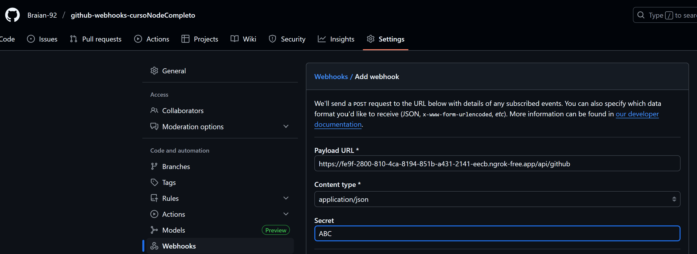

npm init -y

https://gist.github.com/Klerith/3ba17e86dc4fabd8301a59699b9ffc0b

# Typescrip conf

1. Instalar TypeScript y demás dependencias
npm i -D typescript @types/node ts-node-dev rimraf

2. Inicializar el archivo de configuración de TypeScript ( Se puede configurar al gusto)
npx tsc --init --outDir dist/ --rootDir src

3. Crear scripts para dev, build y start

"dev": "tsnd --respawn --clear src/app.ts",
"build": "rimraf ./dist && tsc",
"start": "npm run build && node dist/app.js"

# EJECUTAR 
npm run dev

npm i express
npm i --save-dev @types/express

npm i dotenv env-var

# desplegar local con ngrok

ngrok http 3000

localhost:3000/api/github

https://fe9f-2800-810-4ca-8194-851b-a431-2141-eecb.ngrok-free.app/api/github

# configurar webhook en github usando como tunel ngrok

//! FUNCIONALIDAD EDITOR JSON AS CODE

buscar "PASTE JSON AS CODE"